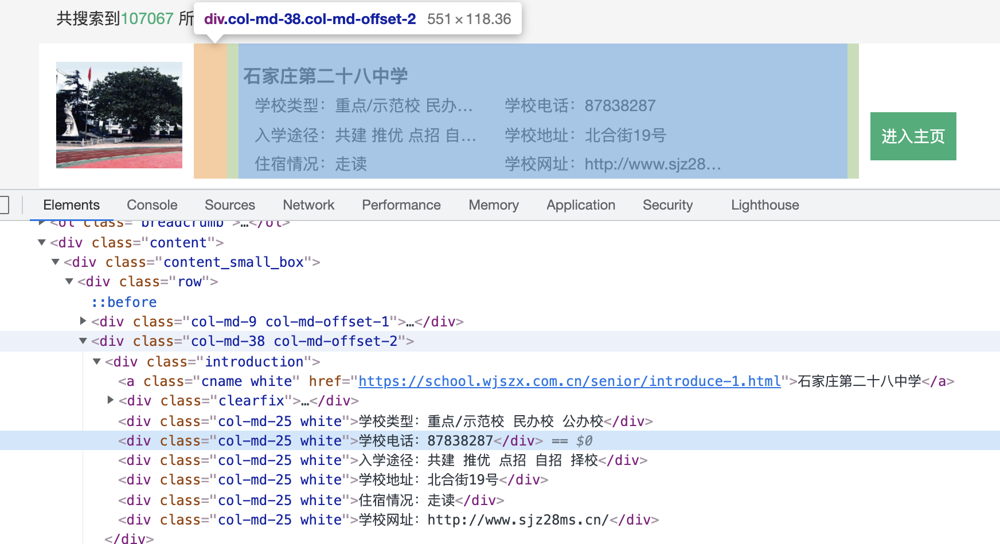
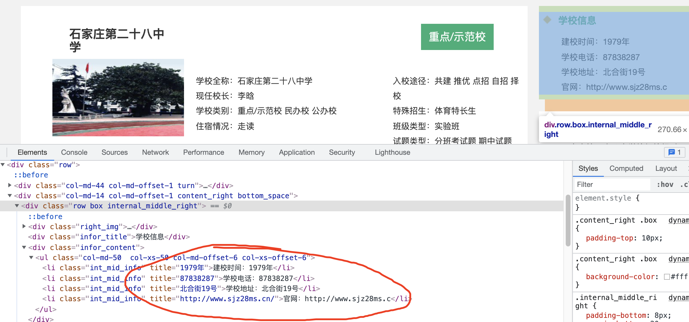

吴江院校库爬虫

https://school.wjszx.com.cn/senior/list.html

帮朋友爬了个国内中小学学校信息，简单记录一下过程

### 结构

code是简单分析的代码

data是最后的数据和处理

Multi_stu是scrapy爬的

## 一、先简单写个爬虫 捋一下思路

这是详情页的url：https://school.wjszx.com.cn/senior/list.html

这是每一页的url：https://school.wjszx.com.cn/senior/introduce-2.html


这是目录页的代码，可以看到没对每个标签打title，后续应该会出错，所以不用目录抓




这是详情页的架构，可以看到设计的很粗糙...每个字段的title直接被赋成了变量，所以直接抓title名就行，也不用对字段就是处理了




首先有几个问题要注意：

- 编码格式问题 导致url取不到
- 直接抓下来的应该是dic类型，要去掉[]变为字段
- 没有信息的字段时可能有啥bug

'''

```
for i in range(10000)

	url = “https://school.wjszx.com.cn/senior/introduce-{}.html”.format(i)

	spider(url)

class spider（url）：

	## 抓
	
	return name, phone, address, url(或者return info)

class saving(info):

	#打开已有的Excel

	#打开sheet

	#固定列 for循环一个字段存入行

	#关闭Excel
```

要记得打一下用时，看看直接暴力抓可不可行

结果是100个抓了97秒

## 二、分析与改进

---

	1. 因为抓到每页信息之后都要打开Excel存入再关闭，是I/O密集型操作，可以使用多线程提升速度。
 	2. 因为python有GIIL锁，多线程有点麻烦。同时，此案例中I/O不容易发生阻塞，多协程应该会更快。
 	3. 访问头headers要记得隐藏，数据大的时候要多写几个然后取随机，IP同理要使用IP池
 	4. 因对方网站比较简陋，猜测没有太多反爬机制，隐藏了header再晚上爬的话应该没啥问题了

## 三、 使用scrapy

---

懒得自己写多线程了，直接用框架吧

pip安装之后，在同级目录下

```
 scrapy startproject stu
```

就会有一个scrapy的工程目录，spiders文件夹里是写爬虫的地方

yield大概相当于return，其他没啥好说的了


settings.py里有几个设置：

```
FEED_EXPORT_ENCODING = 'utf-8'  ##改为utf-8
```

```
ROBOTSTXT_OBEY = True
## 开100个队列，速度我测下来很快了
CONCURRENT_REQUESTS = 100
CONCURRENT_REQUESTS_PER_DOMAIN = 100
CONCURRENT_REQUESTS_PER_IP = 100

#DOWNLOAD_DELAY = 3  ##高级点的网站的话要设置下载延迟，反爬
COOKIES_ENABLED = False
```

这是开爬

```
 scrapy crawl stu
```

开爬并把结果保存为stu.json

```
scrapy crawl stu -o stu.json
```


最后json转Excel的代码没调好，用了一个在线转换https://wejson.cn/json2excel/，txt转Excel的代码是能用的


### 四、参考资料

1. 这是代理池，要用redis启起来https://github.com/Python3WebSpider/ProxyPool
2. https://blog.csdn.net/gyt15663668337/article/details/86345690
3. scrapy的简单介绍https://vip.fxxkpython.com/?p=5038